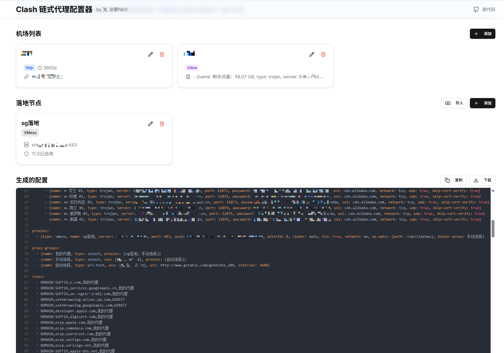
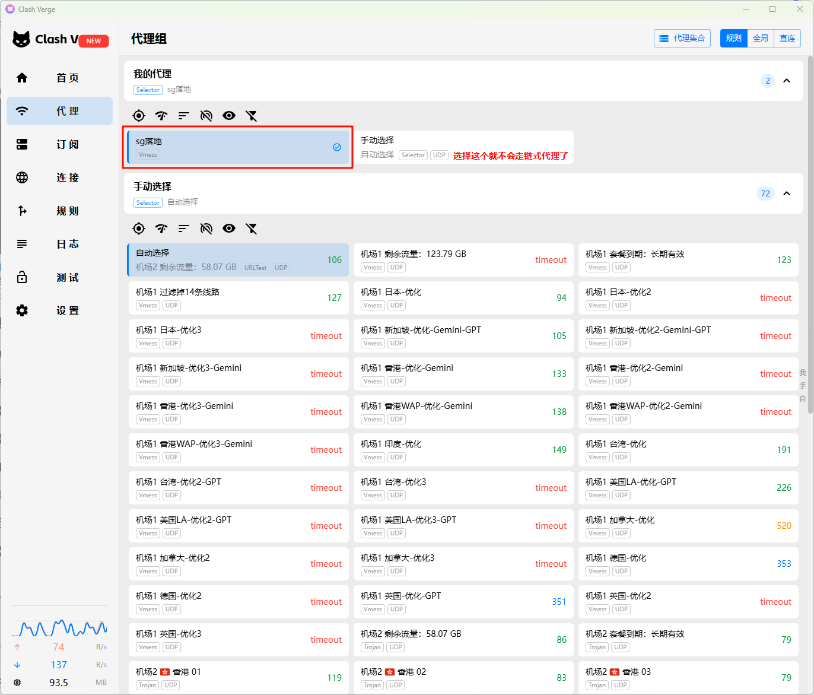

# 使用说明

本项目是一个开源的纯客户端（浏览器）应用，用于根据“机场（代理订阅）”与“落地节点”生成支持`Clash链式代理功能`的 YAML 配置，所有数据存储在浏览器本地，不会上传到任何服务器。
规则使用是[Loyalsoldier/clash-rules](https://github.com/Loyalsoldier/clash-rules)

网址：https://clash-chain-configurator.vercel.app/

## 操作步骤

- 配置机场：有两种类型：`http`（订阅 URL + 更新间隔）和 `inline`（直接粘贴节点 YAML，支持base64加密文本，会自动解密）。
- 配置落地节点：可手动添加或导入（支持多种节点链接格式或 QR）,如果有节点链接，建议您直接使用导入功能，防止编辑时属性填写不完整。
- 配置生成：配置完成后会自动生成yaml配置文件，您可以复制或者下载到本地。
  
- 使用配置：下载后打开`Clash Verge`，选择`订阅`选项卡, 依次点击：`新建 -> 类型(Local) -> 选择文件 -> 确定`，即可导入配置文件。请确保打开了`系统代理`或者`虚拟网卡模式`。
  

## 落地节点说明

由于我本人用的是`vmess`落地节点，因此只测试了这种类型。如果您使用的是其他类型的节点，因为属性不完整导致不可以用的，您可以联系我完善。或者您也可以手动编辑yaml文件（注意不要删除`dialer-proxy`属性）。

## 隐私说明

本应用为纯客户端应用，不会把用户的机场订阅或节点发到外部服务器，所有配置仅保存在本地浏览器存储中（`localStorage`）。

---

This is a [Next.js](https://nextjs.org/) project bootstrapped with [`create-next-app`](https://github.com/vercel/next.js/tree/canary/packages/create-next-app).

## Getting Started

First, run the development server:

```bash
npm run dev
# or
yarn dev
# or
pnpm dev
# or
bun dev
```

Open [http://localhost:3000](http://localhost:3000) with your browser to see the result.

You can start editing the page by modifying `app/page.tsx`. The page auto-updates as you edit the file.

This project uses [`next/font`](https://nextjs.org/docs/basic-features/font-optimization) to automatically optimize and load Inter, a custom Google Font.

## Learn More

To learn more about Next.js, take a look at the following resources:

- [Next.js Documentation](https://nextjs.org/docs) - learn about Next.js features and API.
- [Learn Next.js](https://nextjs.org/learn) - an interactive Next.js tutorial.

You can check out [the Next.js GitHub repository](https://github.com/vercel/next.js/) - your feedback and contributions are welcome!

## Deploy on Vercel

The easiest way to deploy your Next.js app is to use the [Vercel Platform](https://vercel.com/new?utm_medium=default-template&filter=next.js&utm_source=create-next-app&utm_campaign=create-next-app-readme) from the creators of Next.js.

Check out our [Next.js deployment documentation](https://nextjs.org/docs/deployment) for more details.
